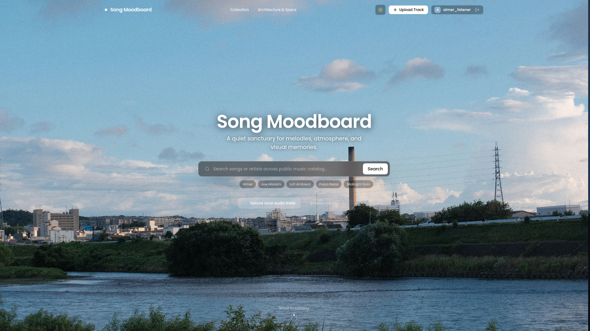

# Song-moodboard

<p align="center">
  
</p>

Personal project. Built to learn CI/CD pipelines, GitHub Actions, and deploying multi-container apps with Docker on a VPS.

Self-hosted music library with YouTube/stream extraction, object storage, and mood-based organization.

---

## Stack

- **Frontend**: SvelteKit (Bun)
- **Backend**: Go 1.23, Chi router
- **Audio**: yt-dlp + FFmpeg (extracts to 320k MP3)
- **Database**: PostgreSQL 16
- **Cache**: Redis 7
- **Storage**: SeaweedFS (S3-compatible)
- **Proxy**: Nginx on port 1122
- **CI/CD**: GitHub Actions → GHCR

```
Browser → Nginx (:1122)
              /api/* → Go backend (:8080) → Postgres, Redis, SeaweedFS
              /*     → SvelteKit SSR (:3000)
```

---

## Image Tags

Images are built and pushed to GHCR automatically via GitHub Actions.

| Trigger | Tags |
|---|---|
| Push to `dev` | `:dev`, `:sha-<commit>` |
| Push to `main` | `:sha-<commit>` |
| Git tag `v*.*.*` | `:latest`, `:<version>`, `:<major>.<minor>`, `:sha-<commit>` |

```bash
# Stable release (latest git tag)
ghcr.io/ijon6k/song-moodboard-backend:latest

# Preview / work in progress
ghcr.io/ijon6k/song-moodboard-backend:dev

# Specific commit (any branch)
ghcr.io/ijon6k/song-moodboard-backend:sha-a3f9c21

# Specific version
ghcr.io/ijon6k/song-moodboard-backend:v0.1.0
```

---

## Development (Local)

Requirements: Docker, Docker Compose.

```bash
git clone https://github.com/Ijon6k/Song-moodboard.git
cd Song-moodboard

docker compose up -d --build
```

Open `http://localhost:1122`.

---

## Self-Hosting

Server only needs two config files and Docker. No source code, no build step.

### Requirements

- A VPS or any server with Docker + Docker Compose installed
- Port `1122` open on your firewall (or change it in `.env`)

### 1. Get the config files

```bash
mkdir song-moodboard && cd song-moodboard

# Download only the files needed for production
curl -O https://raw.githubusercontent.com/Ijon6k/Song-moodboard/main/docker-compose.prod.yml
mkdir -p docker/nginx
curl -o docker/nginx/nginx.conf https://raw.githubusercontent.com/Ijon6k/Song-moodboard/main/docker/nginx/nginx.conf
mkdir -p docker/seaweedfs
curl -o docker/seaweedfs/s3.json https://raw.githubusercontent.com/Ijon6k/Song-moodboard/main/docker/seaweedfs/s3.json
```

> Or just `git clone` the repo and use the files from there. The prod compose only pulls images, nothing gets built.

### 2. Create your `.env` file

```bash
cat > .env <<EOF
# App
PORT=1122
APP_ORIGIN=http://your-server-ip:1122

# Database
DB_USER=songmoodboard
DB_PASSWORD=change-me-please
DB_NAME=songmoodboard_db

# SeaweedFS S3
SEAWEED_ACCESS_KEY=change-me
SEAWEED_SECRET_KEY=change-me

# Auth
JWT_SECRET=change-this-to-something-long-and-random

# Image versions (optional, defaults to :latest)
# IMAGE_BACKEND=ghcr.io/ijon6k/song-moodboard-backend:v0.1.0
# IMAGE_FRONTEND=ghcr.io/ijon6k/song-moodboard-frontend:v0.1.0
EOF
```

### 3. Pull images and start

```bash
docker compose -f docker-compose.prod.yml pull
docker compose -f docker-compose.prod.yml up -d
```

Open `http://your-server-ip:1122`.

### Update to latest release

```bash
docker compose -f docker-compose.prod.yml pull
docker compose -f docker-compose.prod.yml up -d --remove-orphans
```

### Rollback to a specific version

```bash
# By semver tag
IMAGE_BACKEND=ghcr.io/ijon6k/song-moodboard-backend:v0.1.0 \
IMAGE_FRONTEND=ghcr.io/ijon6k/song-moodboard-frontend:v0.1.0 \
  docker compose -f docker-compose.prod.yml up -d

# By commit SHA (for unreleased commits on main/dev)
IMAGE_BACKEND=ghcr.io/ijon6k/song-moodboard-backend:sha-a3f9c21 \
IMAGE_FRONTEND=ghcr.io/ijon6k/song-moodboard-frontend:sha-a3f9c21 \
  docker compose -f docker-compose.prod.yml up -d
```

---

## Useful Commands

```bash
# Logs
docker compose -f docker-compose.prod.yml logs -f

# Status
docker compose -f docker-compose.prod.yml ps

# Stop
docker compose -f docker-compose.prod.yml down

# Stop + wipe all data (destructive!)
docker compose -f docker-compose.prod.yml down -v
```

---

## Notes

Only port `1122` is exposed to the host. Postgres, Redis, SeaweedFS, and the Go API are all internal and not reachable from outside.
